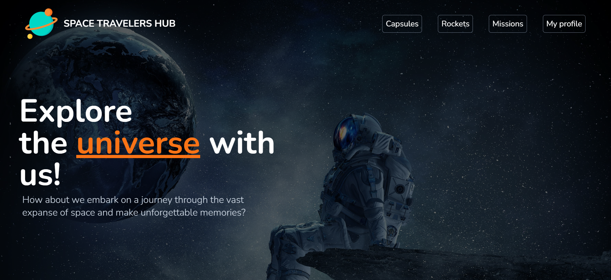

a<!-- TABLE OF CONTENTS -->

# 📗 Table of Contents

- [📖 About the Project](#about-project)
  - [🛠 Built With](#built-with)
    - [Tech Stack](#tech-stack)
    - [Key Features](#key-features)
    - [Live Demo ](#demo)
- [💻 Getting Started](#getting-started)
  - [Setup](#setup)
  - [Guide](#guide)
  - [Prerequisites](#prerequisites)
  - [Install](#install)
  - [Usage](#usage)

<!-- PROJECT DESCRIPTION -->
# Space Traveler

> A web application to share SpaceX data with the worlds. The application will allow users to find capsules, book rockets and join selected space missions.



## 🛠 Built With <a name="built-with"></a>

### Tech Stack <a name="tech-stack"></a>

<details>
  <summary>Frontend</summary>
  <ul>
    <li><a href="https://reactjs.org/">React.js</a></li>
    <li><a href="https://redux-toolkit.js.org/">Redux Toolkit</a></li>
    <li><a href="https://tailwindcss.com/">TailwindCSS</a></li>
  </ul>
</details>
<details>
  <summary>Backend</summary>
  <ul>
    <li><a href="https://docs.spacexdata.com/">SpaceX API</a></li>
  </ul>
</details>

<!-- Features -->

### Key Features <a name="key-features"></a>

- **Capsules List**
- **View details of a specific capsule**
- **Search for a capsule**
- **Filter capsule by status, type and original launch date**
- **Select multiple filter options**
- **View and book rockets**
- **Join selected space missions**

<p align="right">(<a href="#readme-top">back to top</a>)</p>

## Live Demo <a name="demo"></a>

[Live Demo Link](https://space-traveler-rho.vercel.app/)

## Getting Started

To get a local copy up and running follow these simple example steps.

### Prerequisites

In order to run this project you need:

- Latest version of Node
- Git installed

### Setup

```sh
  cd my-folder
  git clone https://github.com/Baayeh/space-traveler.git
  cd space-traveler
```

### Install

Install this project with:

```sh
  npm install
```

### Usage

To run the project, execute the following command:

```sh
  npm start
```

<p align="right">(<a href="#readme-top">back to top</a>)</p>

## Authors

👤 **Kwasi Antwi Baayeh**

- GitHub: [@githubhandle](https://github.com/Baayeh)
- LinkedIn: [LinkedIn](https://linkedin.com/in/kabaayeh)
- Twiiter: [Twitter](https://twitter.com/Cest_Baayeh)

👤 **Samuel Moiwa**

- GitHub: [@githubhandle](https://github.com/samuelmoiwa)
- Twitter: [@twitterhandle](https://twitter.com/samuelmoiwa)
- LinkedIn: [LinkedIn](https://www.linkedin.com/in/ing-abdulai-samuel-moiwa-726340142/)

<p align="right">(<a href="#readme-top">back to top</a>)</p>

## 🤝 Contributing

Contributions, issues, and feature requests are welcome!

Feel free to check the [issues page](../../issues/).

## Show your support

Give a ⭐️ if you like this project!

## Acknowledgments

- Microverse
- SpaceX API

## 📝 License <a name="license"></a>

This project is [MIT](./LICENSE) licensed.

<p align="right">(<a href="#readme-top">back to top</a>)</p>
